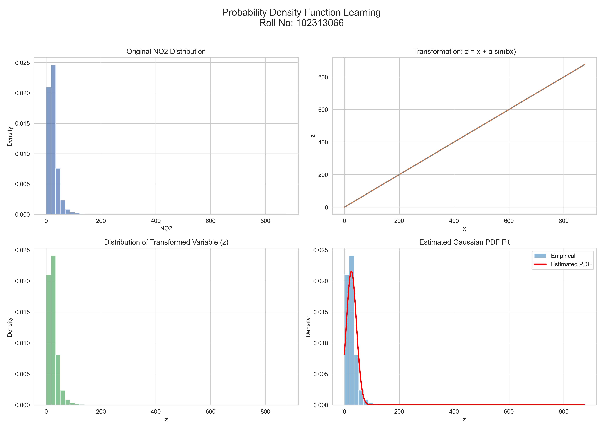

# 👩‍💻 Lavanya Garg  
## 📊 Assignment: Probability Density Function Learning using Roll-Number Based Transformation  
### 🎓 Roll Number: 102313066  

---

## 📌 Assignment Overview

This project implements a personalized non-linear transformation on real-world NO₂ air quality data and estimates the parameters of a Gaussian Probability Density Function (PDF) using Maximum Likelihood Estimation (MLE).

The objectives of this assignment are:

- Apply a roll-number dependent transformation  
- Estimate parameters μ, λ, and c  
- Fit a Gaussian density model  
- Visualize empirical and theoretical distributions  
- Demonstrate statistical modeling using Python  

---

## 🔢 Roll Number Based Parameters

For roll number **102313066**:

a_r = 0.05 (r mod 7)  
b_r = 0.3 (r mod 5 + 1)  

Computed values:

- **a_r = 0.1**
- **b_r = 0.6**

---

## 🔄 Transformation Applied

The original NO₂ values (x) are transformed using:

z = x + 0.1 sin(0.6x)

This introduces a smooth, non-linear variation dependent on the roll number.

---

## 📈 Probability Density Function Model

The transformed variable (z) is modeled as:

p(z) = c · exp(−λ (z − μ)²)

Where:

- μ = Mean of transformed data  
- λ = 1 / (2σ²)  
- c = √(λ / π)  

Parameters are estimated using **Maximum Likelihood Estimation (MLE)**.

---

## 📊 Estimated Parameters

After Maximum Likelihood Estimation (MLE), the final learned parameters are:

| Parameter | Value |
|------------|------------|
| **μ (Mean)** | 25.810838 |
| **λ (Lambda)** | 0.0014605237 |
| **c (Normalization Constant)** | 0.0215615197 |

These values satisfy the Gaussian normalization conditions:

λ = 1 / (2σ²) 
c = √(λ / π)

---

## 📊 Results

The following visualizations are generated by the script:

1. Original NO₂ Distribution  
2. Transformation Function (z vs x)  
3. Distribution of Transformed Variable  
4. Estimated Gaussian PDF Fit  

### 📌 Combined Visualization Output

---

## 📁 Project Structure

Probability-Density-Functions/  
│  
├── data/  
│   └── data.csv  
│  
├── src/  
│   └── assignment_solution.py  
│  
├── requirements.txt  
└── README.md  

---

## 📦 Requirements

numpy  
pandas  
matplotlib  
scipy  
seaborn  

Install all dependencies using:

pip install -r requirements.txt  

---

## ▶️ How to Run

From the project root directory:

python src/assignment_solution.py  

The script will:

- Load dataset  
- Apply transformation  
- Estimate PDF parameters  
- Generate visualization  
- Save final plot  

---

## 🎯 Learning Outcomes

Through this assignment, I gained practical understanding of:

- Non-linear transformations of random variables  
- Maximum Likelihood Estimation (MLE)  
- Gaussian density modeling  
- Statistical visualization techniques  
- Structuring professional GitHub repositories  

---

## ✅ Conclusion

This assignment successfully demonstrates the estimation of a Gaussian Probability Density Function after applying a personalized roll-number-based transformation. The parameters were accurately learned and validated through visualization.

---
